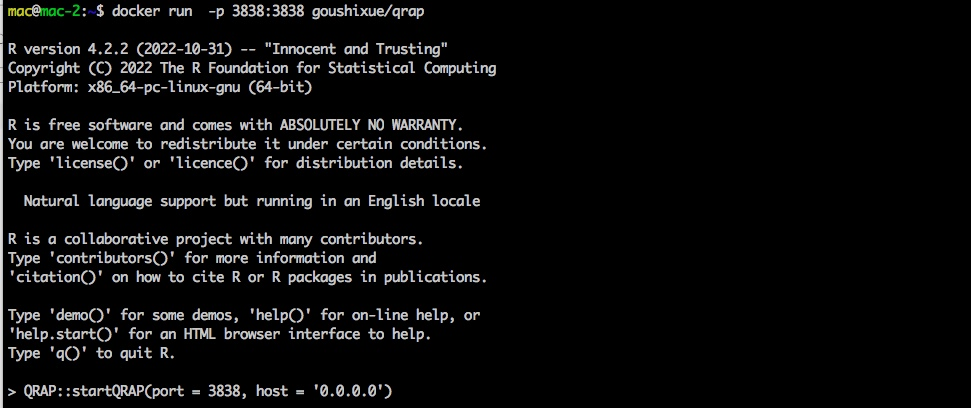

# Introduction {#intro}
## Introduction
<p style = "text-align:justify"><strong>Motivation:</strong> RNA-sequencing (RNA-seq) has become the most commonly used tool in life science research for exploring whole transcript profiles. The advancement of next-generation sequencing has promoted a large amount of RNA-seq data. However, the popularity of bioinformatics lags far behind the generation of sequencing data, resulting in the inability of most researchers to analyze RNA-seq data. Although a large number of tools are currently available for RNA-seq analysis, data uploading, analysis, and visualization through an interactive interface are more acceptable to researchers than command-line codes.</p>
<p style = "text-align:justify"><strong>Results:</strong> We designed an interactive RNA-seq analysis toolkit based on the R Shiny package, named QRAP (Quick RNA-seq Analysis Platform), which can easily accomplish RNA-seq data analysis and visualization through a user-friendly interface on the web page. As a comprehensive RNA-seq analysis tool, QRAP can support the analysis of publicly available and user-generated data, which include regular RNA-seq data, time-course RNA-seq data, and clinically relevant RNA-seq data, and provide functional annotation for approximately 500 species.</p>
<p style = "text-align:justify"><strong>Availability and implementation:</strong> As an open source R package, QRAP can be freely accessed at https://github.com/gsx-ucas/QRAP.</p>
## Installation
### R package
To install QRAP, R version 4.0 or greater is required. We also recommend installing R Studio. \

#### Install the release version of QRAP
```{r eval=FALSE}
# Enter commands in R (or R studio, if installed) 
# Install the remotes package install.packages('devtools') 
devtools::install_github("gsx-ucas/QRAP")
```
#### Install the development version of QRAP
```{r eval=FALSE}
# Enter commands in R (or R studio, if installed) 
# Install the remotes package install.packages('devtools') 
devtools::install_github("gsx-ucas/QRAP", ref = "dev")
```
### Docker image
We provide docker images for QRAP via dockerhub. To pull the latest image using the command line:
```{r eval=FALSE}
# Enter commands in shell
docker pull goushixue/qrap:latest
```
## Get started
### Launch the QRAP application in R or Rstudio
```{r eval=FALSE}
library(QRAP) # loading the QRAP library to R environment
startQRAP() # launch the QRAP application to web browser
```
Then you would get the link to activate your browser: \
 \
Use the link http://127.0.0.1:4986 to access the interactive analysis interface. Note that the port (4986) should change to yours. \

### Launch the QRAP application by docker image in shell
```{r eval=FALSE}
docker run  -p 3838:3838 goushixue/qrap # use the 3838 port 
```
Then you would get the output like this: \
 \
Use the link http://localhost:3838/ to access the interactive analysis interface. \

### Access the interactive analysis interface
Just start your analysis by clicking, clicking, clicking... \
 \

