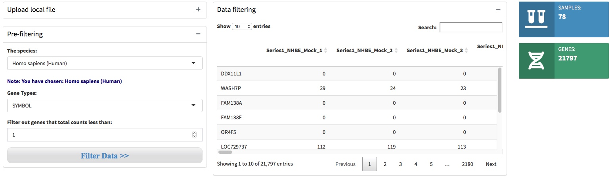
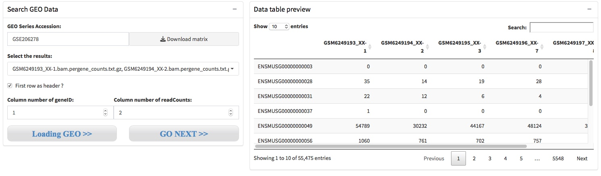
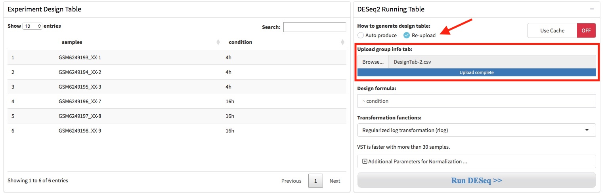

# Data input and pre-processing

## Data input
QRAP can support to analyze publicly available and user-generated data. There are two action buttons, 'Get Started Local' and 'Get Started GEO', can activate corresponding data upload and processing pipeline. 

### Upload local file
For user generated local files, click the 'Get Started Local' button to enter the data upload page. Users need to upload a read-count matrix, in which rows represent the genes and columns represent the samples, while the contents represent the gene expression values of given sample

***Parameters in this section:*** \
- Choose input file: browser and upload the expression matrix file, accept .csv/.tsv/.tab/.txt format. \
- First row as header ? This means use the first row of the expression matrix as column names, often is samples names. \
- First column as rownames ? This means use the first column of the expression matrix as row names, often is gene names. \

After select the local files and set the parameters, click the 'Upload' button to preview the expression matrix.

Click 'Example' will upload the example dataset internal, transcriptomes of SARS-Cov-2 infected normal human bronchial epithelial cells (GSE147507).

### Pull down GEO datasets
The Gene Expression Omnibus (GEO) is a public repository that archives and freely distributes comprehensive sets of microarray, next-generation sequencing, and other forms of high-throughput functional genomic data submitted by the scientific community. 

For GEO datasets, users need to input an accession number to query the gene expression matrix through GEOquery. After you input the GEO Acession Number and active the 'Download matrix' button, We will download the value matrix tables within GDSxxx or supplementary files within GSExxx, these files will store in the working directory of the R project you created. \
 \

When the files download accomplished, there will show the download files name in the Parameter setting panel, and you should select file(s) that contain interested gene expression matrix and active the 'Loading GEO' button to preview the matrix. \
 \
Please Note that if the files are in a tar archive format, such as htseq-count generated results, these files will contain Gene ID and Gene Expression Value of each sample, respectively. Therefore, you need to provid the column number of the Gene ID and Gene Expression Value to help merge the files to generate an analysis ready gene expression matrix.

- Step 1. Choose a single file, and leave the 'First row as header' and 'First column as rownames' unchecked, then click the button 'Loading GEO' to preview what the file contained. \

- Step 2. Choose all or interested files, set the column number of geneID and readCounts, then click the button 'Loading GEO' to generate and preview the analysis ready expression matrix. \

## Data pre-filtering
QRAP starts with a read-counts matrix or GEO accession number, and then filters out low expression genes under an given threshold. We then specify the organisms and filtered out low expression genes. \

###### Note the Gene Types:{-}

| SYMBOL      | ENSEMBL | ENTREZID     |
| :---        |    :----   |          :--- |
| GAPDH      | ENSG00000111640       | 2597   |
| TP53   | ENSG00000141510        | 7157      |

## Design table & formula
A DESeqDataSet object must have an associated design formula. The design formula expresses the variables which will be used in modeling. QRAP will automatically produces an dataframe that contain sample names in the first column and condition variables in the second column. The condition column was simply generated by deleting the replicates numbers (eg. -1, -2, -3). User can download this design table by the button where the arrow indicated.

If the condition variables in the second column were not produced correctly, user should adjust it manually in Microsoft Excel and save it as .csv format file. Then, user need choose the 'Re-upload' option where the arrow shows and re-upload the corrected design table through the file upload box.

The formula should be a tilde (~) followed by the variables, and the is used to estimate the dispersions and to estimate the log2 fold changes of the model. The transformation functions can be specified as rlog (regularized logarithm) and vst (variance stabilizing transformations). 

## Batch effect correction
If there is unwanted variation present in the data (e.g. batch effects) it is always recommend to correct for this. The batch effects can be accommodated in DESeq2 by including in the design any known batch variables, and estimated by functions ComBat in sva (Leek 2014) or removwBatchEffect in limma (Matthew et al. 2015). 
1. For performing batch effect correction, the two factor variables batch and condition should be columns of the design table.

2. Setting the batch correction parameters by click "Additional Parameters ..." button. Two functions were provide to perform batch correction, ComBat in sva  or removwBatchEffect in limma.

