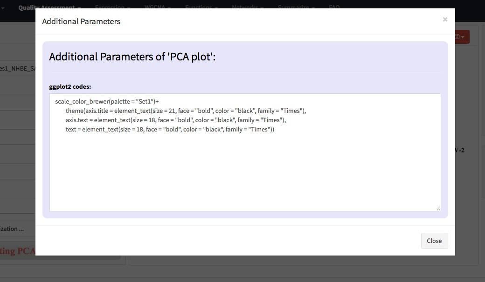
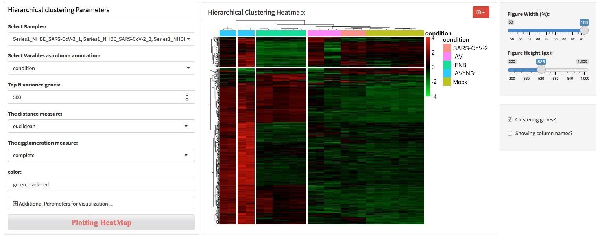
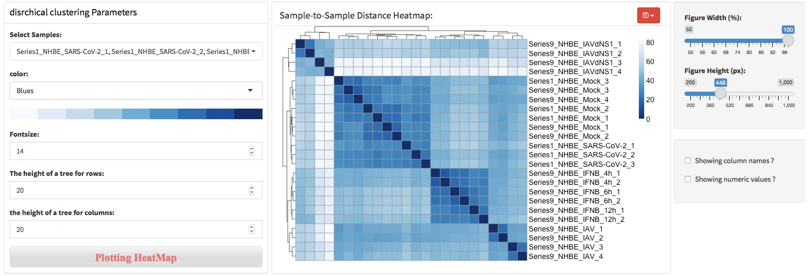
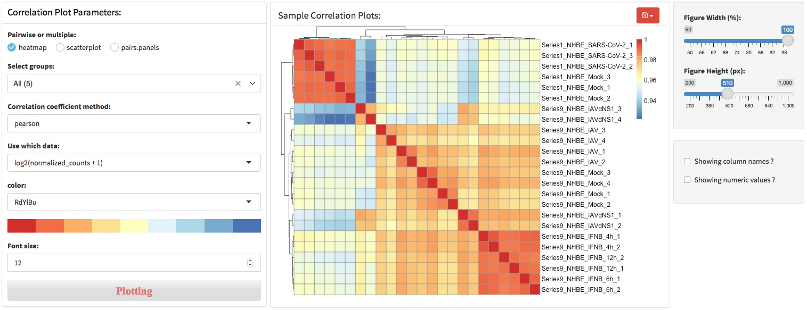

# Data quality exploring

In biological experiments, it is often necessary to set up technical and biological repetition to avoid accidental variation affecting the results. RNA-seq usually sets 3-5 biological repeats, so it is necessary to confirm the quality of biological repetitions and determine that the sequencing data can truly reflect the transcriptome changes across experimental conditions. Principal components analysis (PCA), hierarchical clustering heatmap, sample to sample heatmap and sample correlation coefficient was the most used method to assess the sequencing data quality, which can identify bad sample replicates and batch effects.

## Principal component analysis (PCA)

Principal component analysis (PCA) is a mathematical algorithm that reduces the dimensionality of the data while retaining most of the variation in the data set1. It accomplishes this reduction by identifying directions, called principal components, along which the variation in the data is maximal. By using a few components, each sample can be represented by relatively few numbers instead of by values for thousands of variables. Samples can then be plotted, making it possible to visually assess similarities and differences between samples and determine whether samples can be grouped.

As shown in the screenshot below, left panel provides the parameters to perform PCA and visualize the results, middle panel will show the visualization results, and right panel provides the control of the width and height of figure. 

For users with programming skills, ggplot2 codes can be added to modify the figure layer directly. Just note that do not add plus sign (+)  at the beginning of the first line codes.

## Hierarchical clustering
Hierarchical clustering analysis is an algorithm that groups similar objects into groups called clusters. The endpoint is a set of clusters, where each cluster is distinct from each other cluster, and the objects within each cluster are broadly similar to each other. In RNA-seq, the objects can be samples or genes. HCA is often combined with heatmap to show the cluster of samples in the column and genes in the rows.

The agglomeration algorithm of hierarchical clustering combines the two most similar data points (genes or samples) of all data points by calculating the similarity between the two types of data points, and iterates this process repeatedly. To put it simply, the agglomeration algorithm of hierarchical clustering is to determine the similarity between each category of data points and all data points by calculating the distance between them. The smaller the distance, the higher the similarity. And the two nearest data points or categories are combined to generate a cluster tree.

To perform hierarchical clustering analysis, users should specify how many genes to used for this analysis. Typically, top 500 or 1000 most high variable genes will be used for clustering genes and samples. 

To change colors of the heatmap, users can enter three colors separated by comma. The colors entered will be used to generate an continuous color vector to specify the colors of heatmap. For example, to generate a heatmap colored by 'green,black,red'.

To divide the heatmap based on the hierarchical clustering, users can specify the parameters throung 'Additional parameters ...'.

## Sample-to-sample distance

Sample-to-sample distance (SSD) is another method to assess sequencing and sample replicates quality based on calculated distance between samples. SSDA calculated similarity between samples based on distance metrics, which specify how the distance between the input samples. A commonly used approach for measuring sample distance in RNA-seq data is to use Euclidean distance.

SSD can elucidate samples distance in the high-dimensional space. In RNA-seq data, each gene is a dimension, so the data has tens of thousands of dimensions. SSD uses Euclidean distance to elucidate samples distance in the high-dimensional space, which helps to understand the relationship of samples across experimental conditions or sample replicates. The heatmap clusters samples with similar distances, which makes the results easier to interpret.

## Sample correlation coefficient

The correlation coefficient is a statistical measure of the strength of the relationship between the relative movements of two variables. The values range between -1.0 and 1.0. A calculated number greater than 1.0 or less than -1.0 means that there was an error in the correlation measurement. A correlation of -1.0 shows a perfect negative correlation, while a correlation of 1.0 shows a perfect positive correlation. A correlation of 0.0 shows no linear relationship between the movement of the two variables.

Correlation statistics can be used in RNA-seq for assessing data quality. For example, a correlation coefficient could be calculated to determine the correlation between sample replicates, which indicate the biological replication quality of samples. Another example, a correlation coefficient between conditions, such as treatment group and WT control, could indicate the treatment effects.

Three visualization methods were provided in this section, heatmap, scatterplot and pairs.penels.

- heatmap

- scatterplot

- pairs.penels
