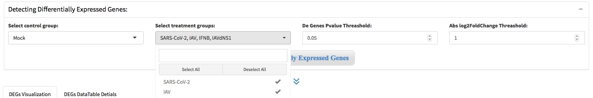
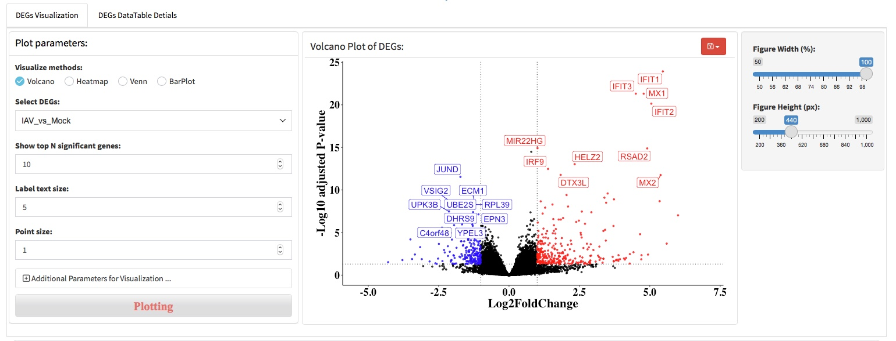
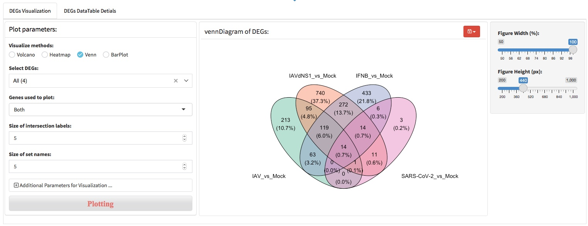
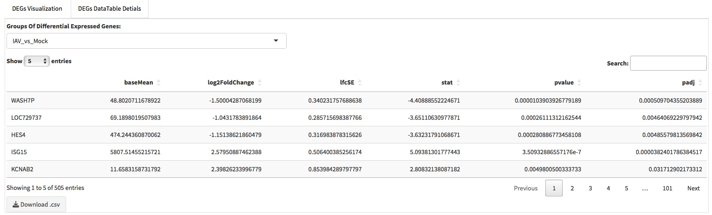

# Differential expression analysis

The most important application of RNA-seq is to detect differentially expressed genes between variance conditions or groups. Differential expression analysis (DEA) requires that gene expression values should be compared among samples. We chose the DESeq2 package to perform the expression normalization to adjust abundance quantities in order to account for differences in read depth across the samples. After that, the function ‘results’ of DESeq2 wase used for calculating the foldchange of gene expression levels and P-values across experimental and control condition. 

## Extract DEGs

DESeq2 offers two kinds of hypothesis tests: the Wald test, where we use the estimated standard error of a log2 fold change to test if it is equal to zero, and the likelihood ratio test (LRT). The LRT examines two models for the counts, a full model with a certain number of terms and a reduced model, in which some of the terms of the full model are removed. The test determines if the increased likelihood of the data using the extra terms in the full model is more than expected if those extra terms are truly zero. 

### Wald significance tests 
To extract DEGs, user should specify one group as control, and one or more groups as treatment. Then, the threshold of P value and log2 fold change shold be specified as well. Most commonly used standard to define differentially expressed gene (DEG) is |log2FoldChange| > 1 and P-value < 0.05, but we also provide the options for user’s custom defined standard to filter DEGs.

### Likelihood ratio test
To extract DEGs by LRT, user just need to specify one group as control and one groups as treatment, cause LRT will return only one group DEGs. P-value threshold should be set no more than 0.05. Note that log2FoldChange should be set to 0. 

## Visualize DEGs

We provide five approaches to visualize the DEGs, include volcano plot, MA-plot, bar-plot, heatmap, venn diagram.

- Volcano plot

- Heatmap

- Venn diagram

- Bar-plot

- The details of DEGs
