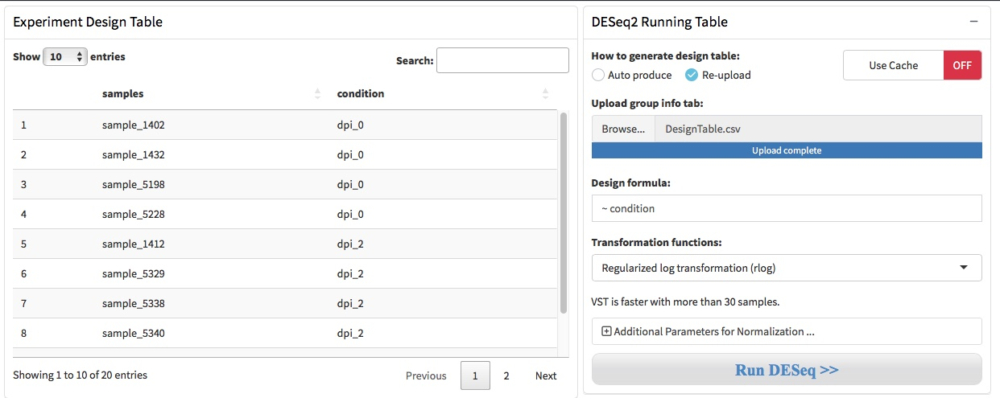
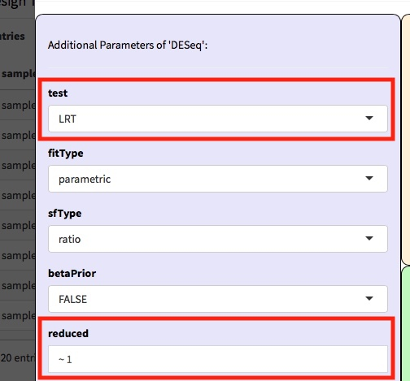
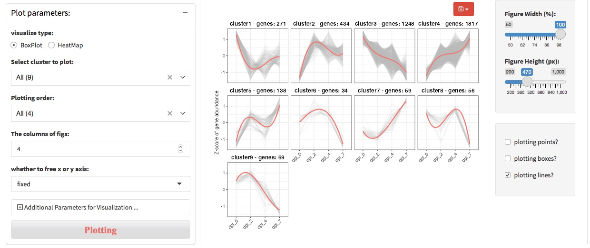
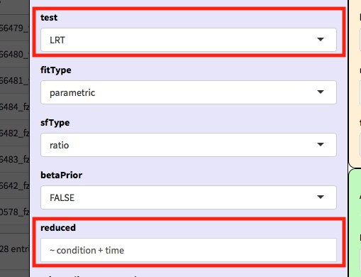

# DEG expression pattern detection

Research involved time series experiment would more interested in genes that differentially expressed along time points. We provide the DEGreport pacakge to distinguish different gene expression patterns of differentially expressed genes. For example, we group genes that expression increase over time into one expression pattern, and group genes that expression decrease over time into another expression pattern. These differentially expressed genes show different expression patterns over time, suggesting that they may have different biological functions and meanings.

## One-way time coures experiment

### pre-processing and preparation

For the time-course experiment that only the first time point was set as the control, DEGs were detected at each time point in contrast to the first time point. 

- The condition should be time points.

- Or using LRT to detect DEGs which at one or more time points after time 0. Set test method as "LRT" and reduced as "~ 1".

### Detect DEG expression pattern
Then, the DEGreport package was employed to calculate the gene similarity among samples and cluster the genes into expression patterns. To detect the DEG expression patterns, user should specify the group of DEGs, such as dpi_2_vs_dpi_0 and dpi_4_vs_dpi_0. And user need to specify the variable with which the gene expression changes. Due to there is only one time course of the experiment, thus we leave the "variable to separate samples" to NULL.

### Visualize DEG expression pattern

User can select DEG expression pattern clusters to visualize the results, and adjust the time point order by specifing the 'plotting order' option.

## Two-way time coures experiment

### pre-processing and preparation

For time-course experiment that sets a control at each time point, an appreciate way to detected DEGs over time is use the likelihood ratio test (LRT) with the design formula like “~ condition + time + condition:time”, and reduced formula like "~ condition + time". 

- set design formula as “~ condition + time + condition:time”

- set test method as "LRT" and reduced formula as “~ condition + time”

- Or detected DEGs at each time point contrast to the corresponding control in the common manner.

### Detect DEG expression pattern
Due to there would be more than one time course of the experiment, thus we set "variable that changes" to "time" and set "variable to separate samples" to "condition".

### Visualize DEG expression pattern

User can select DEG expression pattern clusters to visualize the results, and adjust the time point order by specifing the 'plotting order' option.

