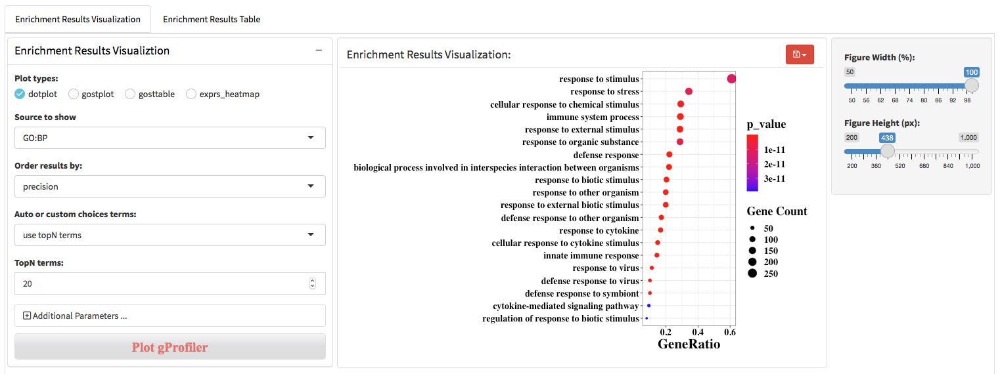
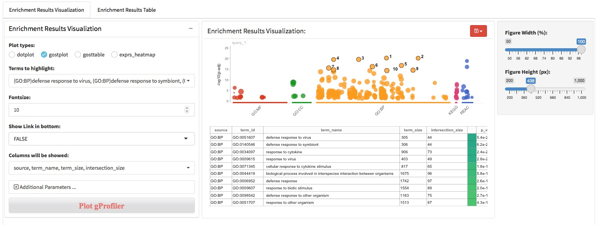
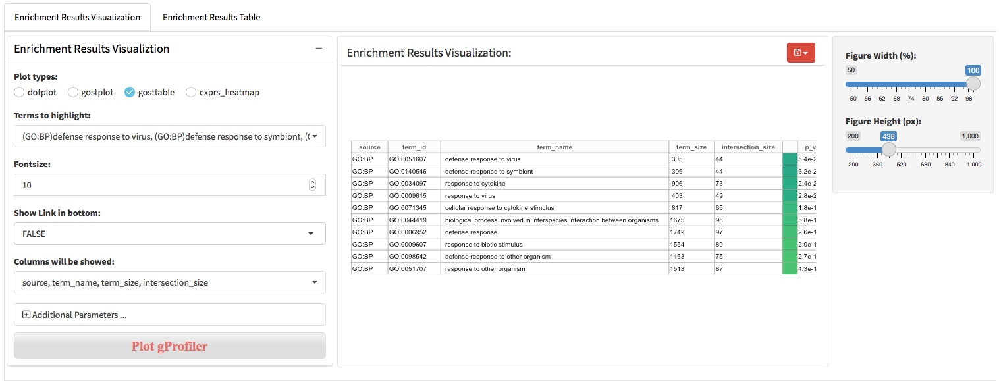

# functional enrichment analysis
After the differential expression analysis and biological pattern detection (DEG patterns and WGCNA modules), functional enrichment analysis was usually used to characterize the molecular functions or pathways in which genes involved. There are two main approaches to perform the functional enrichment analysis, (i) ORA that using a list of genes of interest as input and (ii) GSEA that using all genes ranked by log2foldchange as input. We apply clusterProfiler and gprofiler2 (an R client of g:Profiler) to perform the ORA and GSEA analysis. In addition to supporting the use of Gene Ontology, KEGG, and Reactome knowledge base, gprofiler2 also support WikiPathway, miRTarBase, TRANSFAC, Human Protein Atlas, CORUM and Human Phenotype Ontology knowledge base. 

## Gprofiler API

g:Profiler is a public web server for characterising and manipulating gene lists. The R package gprofiler2 provides an R interface to the g:Profiler tools. g:Profiler is developed and maintained in Estonia, at the University of Tartu, Institute of Computer Science, Bioinformatics, Algorithmics and Data Mining Group BIIT. Currently g:Profiler is developed and maintained by a team of professional software developers, statistician and researchers.

## ClusterProfiler-ORA

## ClusterProfiler-GSEA
