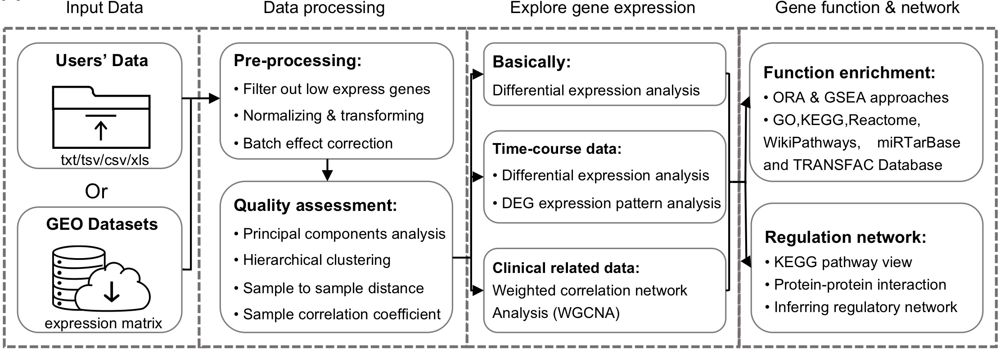
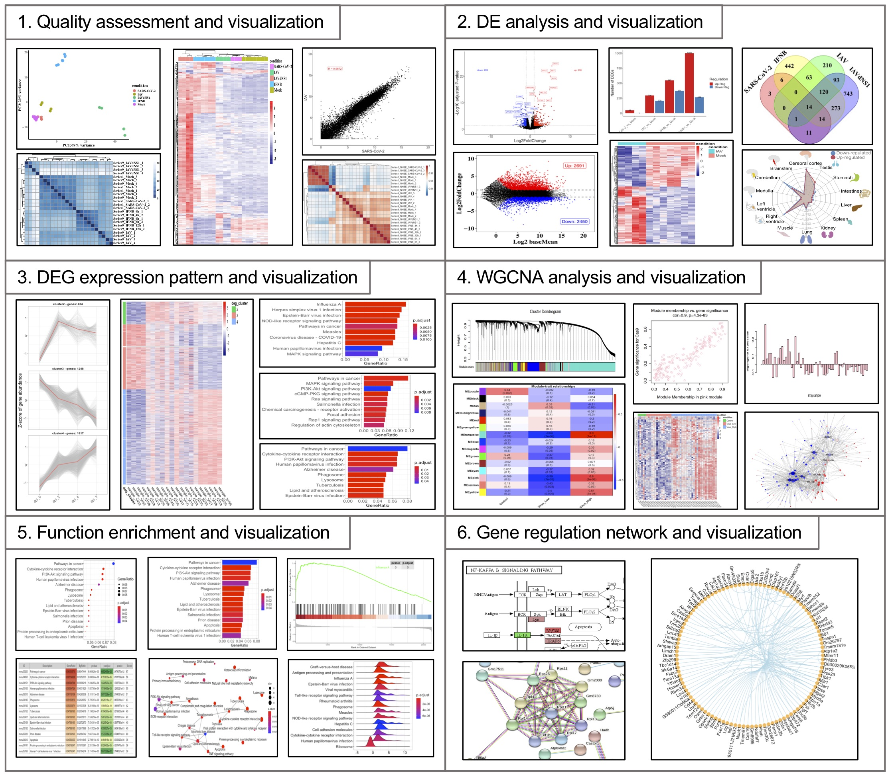

## QRAP
RNA-Sequencing (RNA-seq) has become the most commonly used tool in life science researches for exploring whole transcript profiles. The advance of second-generation sequencing (NGS) has promoted a large number of RNA-seq data. However, the popularity of bioinformatics lags far behind the generation of sequencing data, resulting in the inability of most researchers to analyze RNA-seq data. Although a large number of tools are currently available for RNA-seq analysis, data uploading, analysis, and visualization through an interactive interface are more acceptable to researchers than command-line code. Therefore, we have designed an interactive analysis platform based on Shiny, named QRAP, which can easily accomplish RNA-seq data analysis through an intuitive graphical interface on the web page. QRAP support to analysis publicly available and user generated data, including multiple RNA-seq analysis modules, and provide more than 500 species’s function annotation.

## Workflow


## Features



## Installing

### Depends
- R (>= 3.5.2)
- STRINGdb (>= 2.3.0)
- DOSE (>= 3.16.0)
- enrichplot (>= 1.10.0)
- fgsea (>= 1.16.0)
- clusterProfiler (>= 3.18.0)
> Unpredictable errors may occur if these packages are lower than the specified version

### Installation
Install the QRAP from github:
```
## install.packages("devtools") ## you may need install devtools first
devtools::install_github("gsx-ucas/QRAP")
```
## Getting Start

### Launch the QRAP
```
library(QRAP)
startQRAP()
```
### Start your anlysis


## Documentation
The documentation is available at <a href="https://gsx-ucas.github.io/QRAP/" target="_blank"> here </a>, the doc include a tutorial and example gallery.

## Development

QRAP development takes place on Github: <a href="https://github.com/gsx-ucas/QRAP" target="_blank">https://github.com/gsx-ucas/QRAP</a>

Please submit any reproducible bugs you encounter to the <a href="https://github.com/gsx-ucas/QRAP/issues" target="_blank">issue tracker</a>

We will also put most commonly encountered issues in the ***FAQ*** page.
