## 1. Getting Start

#### 1.1 Launching QRseq

```
library(QRseq)
startQRseq()
```

#### 1.2 Start your anlysis 

As you can see in the home page, there are two action buttons can let you start your data exploring. Click <code>Get Started Local</code> if you want upload your own data, or click <code>Get started GEO</code> to explore the published data sets.


## 2. Data Input

### 2.1 upload data from local

- browse your files to choices the expression matrix file.
- set the header and rownames parameters in the check box.
- don't worry the delemeters, it will be detected automaticaly.
- click the upload button to upload your data, or you can click the example button to load the example datasets.
- after you upload the data, a data table will be showed in the right panel, like this:

<div style="float:left;border:solid 1px 000;margin:2px;"></div>

<div style="float:left;border:solid 1px 000;margin:2px;"></div>

### 2.2 download data from GEO

- searching datasets you are interseted in from geo in our app.
- or you can skip this step if you known exactly which datasets you are interested.
- using searching geo functions, a table will be returned:


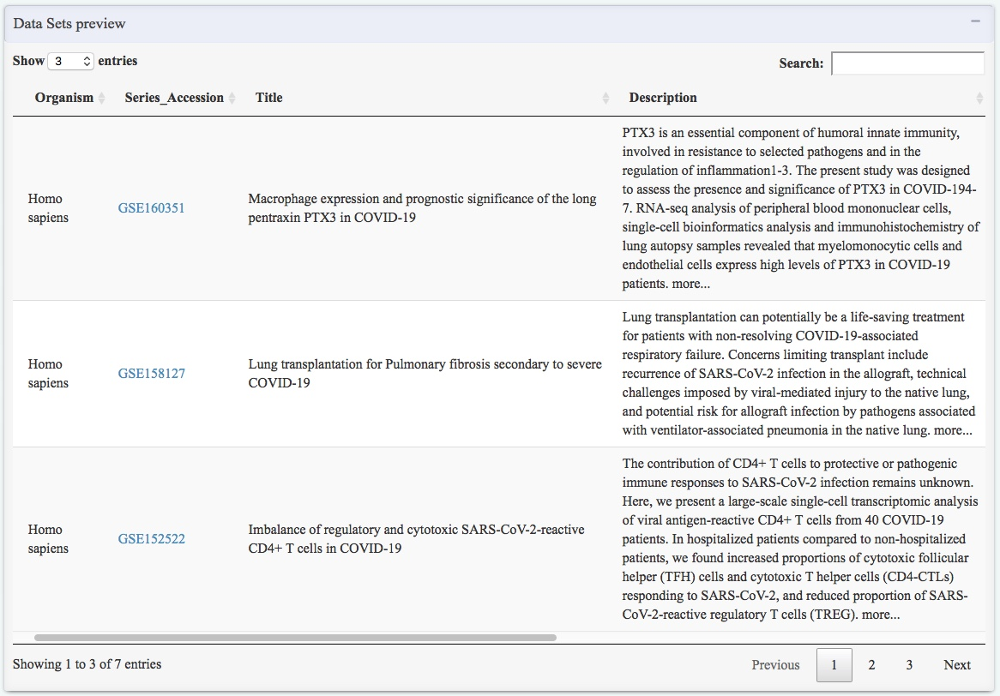


- after detemind which datasets you want to analyze, input this Series_Accession number to the input box and click the fetch data button:

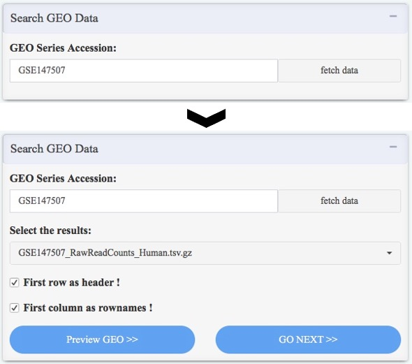 
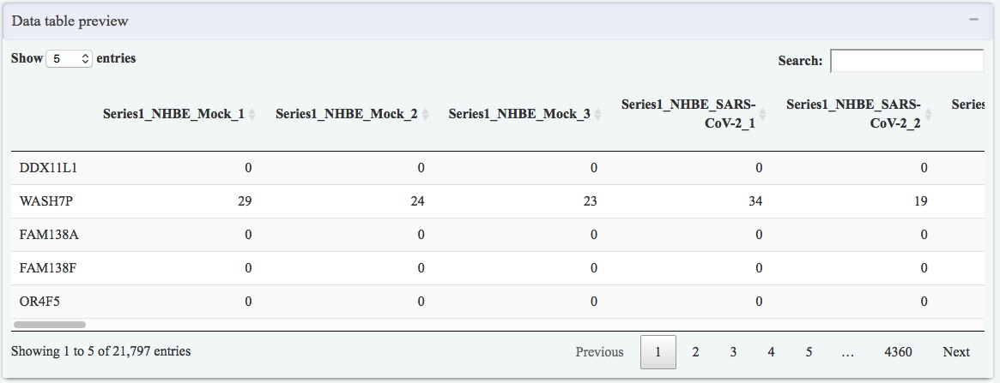

### 2.3 pre-filtering data

- genes with low expression level dose no means for downstream analyis, for speed up the analysis, we firstly filtered out genes have total counts lower than an user defined threshold (default: 1 reads).
- For the downstream analysis, users need select the species and gene types of their datasets.
- after click the filter data button, a density plot will be generated and red line means the cutsite.
- Some words will be printed in the bottom of the density plot, it will tell you how many genes were filtered and how many genes were keeped for downstream analysis.

 
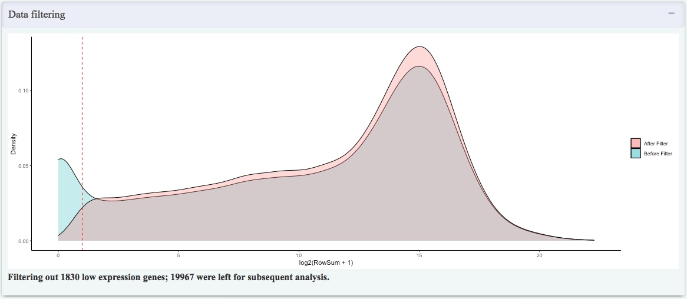

## 3. Data Normalizing and transforming (by DESeq2)

### 3.1 Design the experiment condition table

- If your sample names were named as **sample1-1, sample1-2, sample2-1, sample2-2...**, the condition will be extracted as **sample1, sample1, sample2, sample2...** automaticlly.
- If the condition table was not that one you wanted, you can download it to your computer and modify it to the corrected condition groups, and then upload it to the app to do the next step analysis.

 `>>`


- If your data have a batch effector (can be detected in the data quality assessment part), a column can be added to the design table and this coumn can be treated as batch effector, and will be corrected.
- after finished the experimental condition table, you can run the DESeq normalize data and choices one method (rlog or vst) to transform the normalized expression levels.
- More Parameters for running this step, including correct batch effects, can be accessed by click the Additional Parameters button.

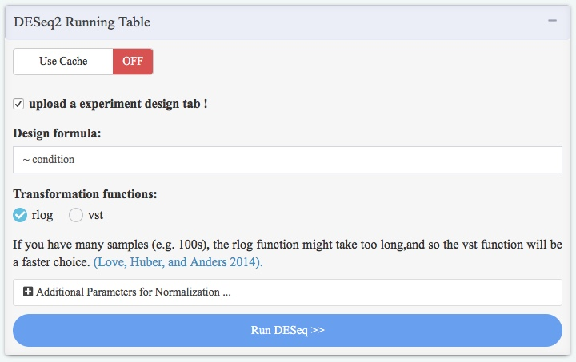
> Additional parametes for running 

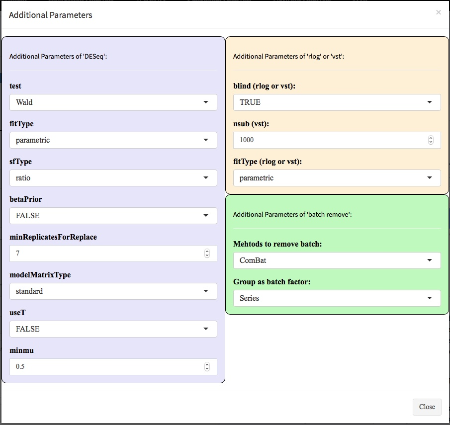

## 4. Data Quality Assessment

### 4.1 Principal Component Analysis (PCA)

> A glob view of analysis page modules, the left panel is parameters which control the runing or visualizing, the middle panel is the region where figures or datatables will be produced and showed, the right panel is the slider for control the figure width and height.


- in the addtional parameters, we provide an directly input of ggplot2 codes, which allow users with programming skills to modify the figures.

> this example below showed that change text family to "Times", text face to "bold" and fontsize to 20 through one line ggplot2 codes.


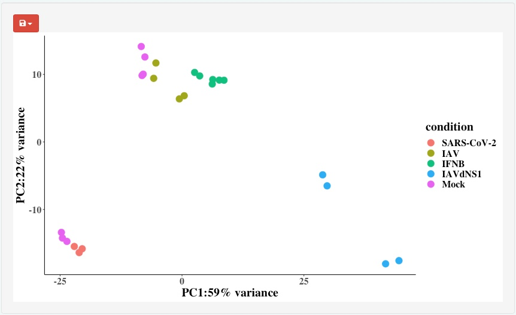

### 4.2 Hierarchical Clustering Heatmap

- We use the top n (default 500) highest variance genes between samples to prudce the hierarchical clustered heatmap.

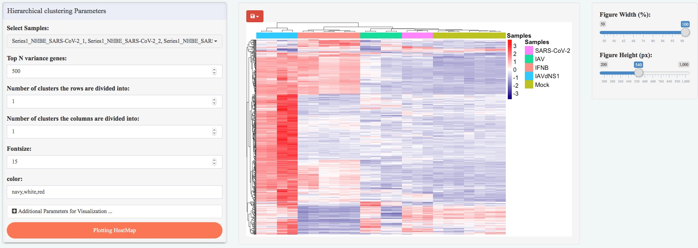

- you can easily change the color and cut the tree to by the clusters.


### 4.3 Sample to Sample Distance


### 4.4 Sample correlation coefficients

- Pairwise Scatter Plot


- multiple groups compare heatmap

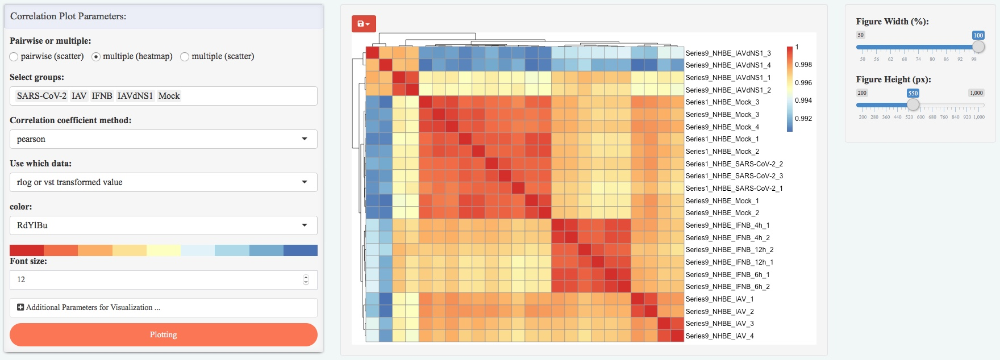

- multiple groups compare scatter plot

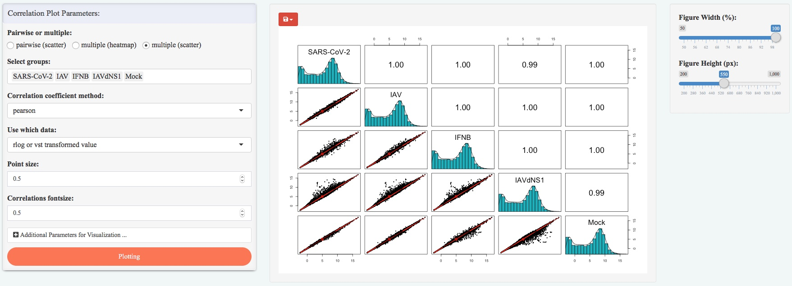

## 5. Differential Expression Analysis

### 5.1 Volcano plot of DEGs

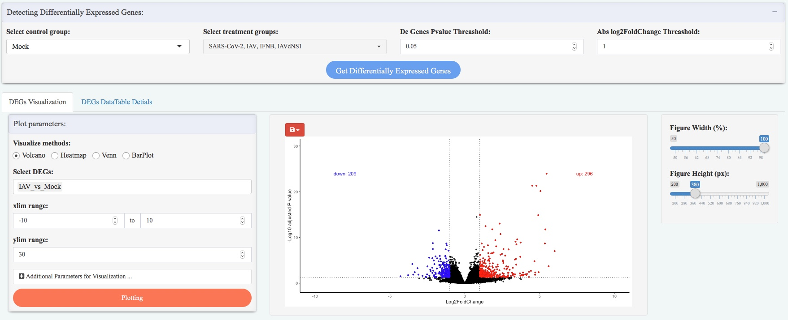

### 5.2 DEG heatmap


### 5.3 DEG VennDiagram

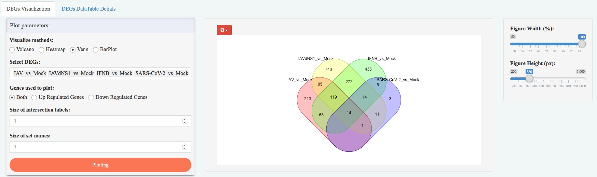

### 5.3 DEG VennDiagram

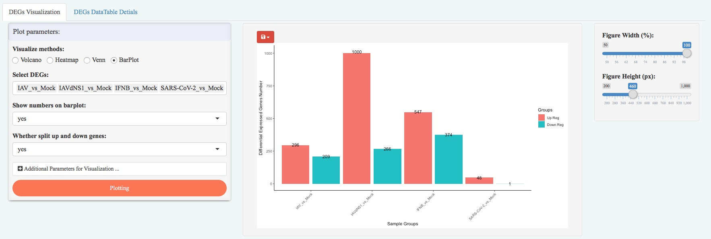

### 5.3 DEG Detail Table


## 6. DEG Patterns Detection


## 7. Gene Expression Visualization

### 7.1 Expression BarPlot


### 7.2 Expression BoxPlot


### 7.3 Expression HeatMap

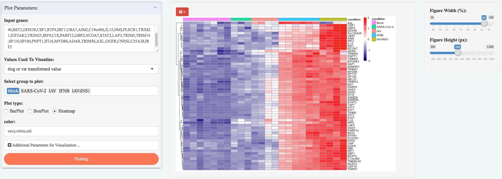

### 7.4 Log2FoldChage BarPlot


### 7.5 Log2FoldChage HeatMap


### 7.6 Log2FoldChage DotPlot

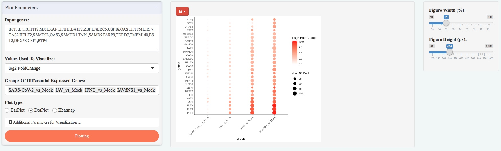

## 8. WGCNA analysis

### 8.1 Data Preparation


### 8.2 Modules Detection


### 8.3 Data Preparation


## 9. ClusterProfiler ORA Enrichment Analysis

### 9.1 Running Parameters

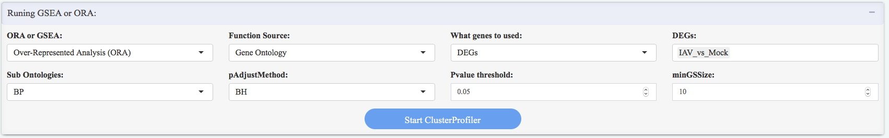

### 9.2 DotPlot


### 9.3 BarPlot


### 9.4 Ggtable

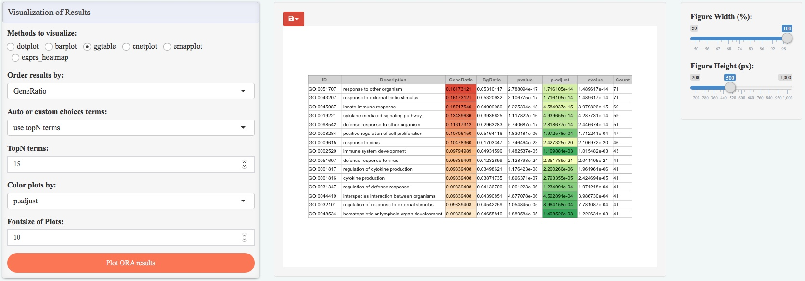

### 9.5 Cnetplot


### 9.6 Emapplot


### 9.7 Pathway Heatmap

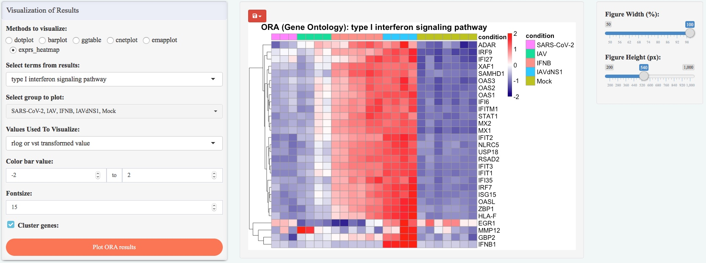

## 10. ClusterProfiler GSEA Enrichment Analysis

### 10.1 Running Parameters

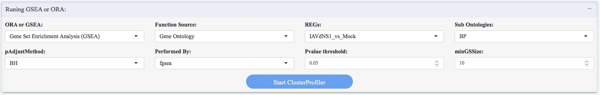

### 10.2 gseaplot2

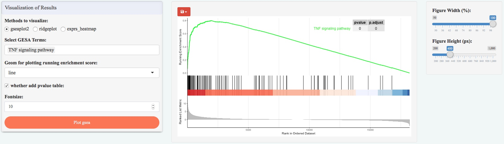

### 10.3 ridgeplot

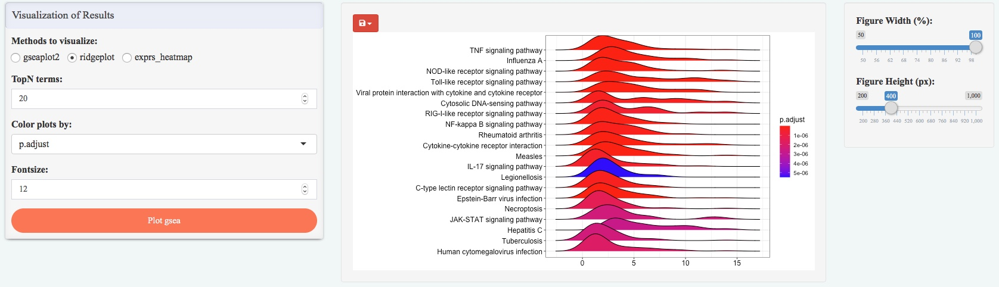

### 10.4 heatmap


## 11. gProfiler2 Enrichment Analysis

### 11.1 Running Parameters

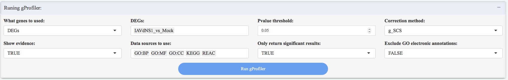

### 11.2 gostplot

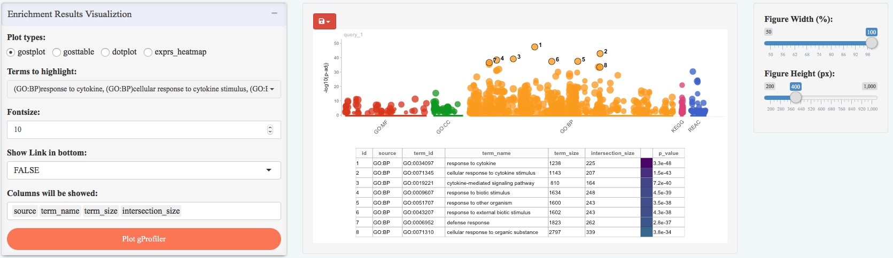

### 11.3 gosttable


### 11.4 dotplot

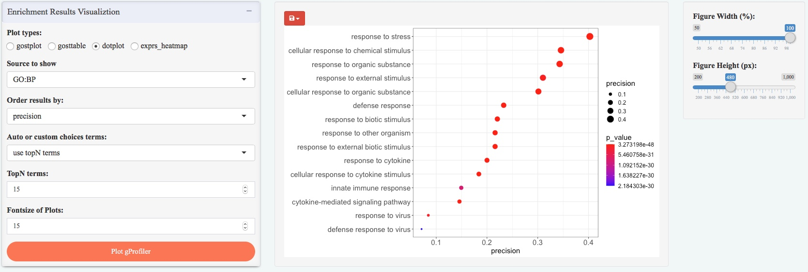

### 11.5 heatmap


## 12. Protein to protein network


## 13. GENIE3 network

### 13.1 edgebundle Plot


### 13.2 visNetwork Plot

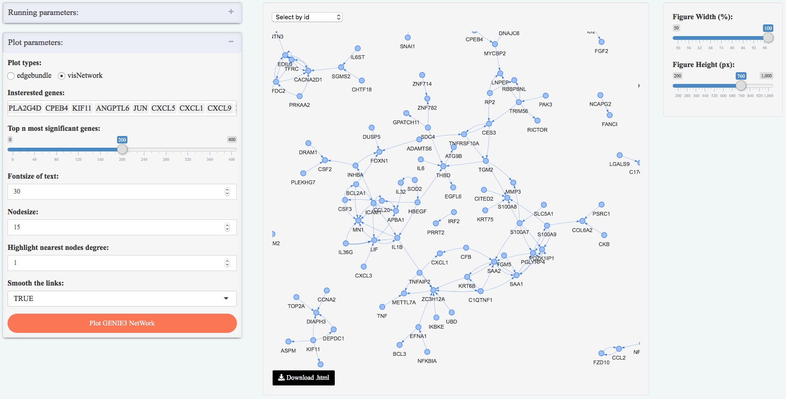

