<p style = "font-size: 2.25em; font-weight: bold; line-height: 1.2; border-bottom: 1px solid #eee;">QRseq: an R Shiny application for analyzing and visualizing RNA sequencing data</p>

<p style = "font-size: 1.25em; font-weight: bold; line-height: 1.2; font-style: italic; border-bottom: 1px solid #eee;">Shixue Gou, Liangxue Lai Lab, Guangzhou Institutes of Biomedicine and Health,Chinese Academy of Sciences</p>

<p style = "font-size: 1.25em; font-weight: bold; line-height: 1.2; font-style: italic; border-bottom: 1px solid #eee;">June 10th, 2021</p>

[TOC]

## 1. Introduction

<font>Here we developed QRseq, an R shiny application that can be launched easily from a local web browser for analyzing sequenced or published RNA-seq data. QRseq allows users to analysis RNA-seq data from local or to analysis published datasets from [GEO](https://www.ncbi.nlm.nih.gov/geo/) fastly and interactively. This application is started from **data input**, followed by preprocessing data by **filtering low expressed genes** and **poorly reproducible samples**, **correcting batch effects**, **normalizing** and **transforming** data, **identifying differential expressed genes** and some **biological patterns**, **exploring the enrichment of functions**, analyzing and visualizing the **protein to protein networks** or **gene regulation networks**. QRseq provides a clear analysis flow and a user-friendly GUI interface but keeps the most important parameters of involved functions, which suit both non-programming experience researchers and expert bioinformatics researchers. User can accomplish a standard RNA-seq analysis in hours depending on the size of their dataset and requires using QRseq.</font>

## 2. Installation and Launch

### 2.1 Run using docker (Recommended):

Make sure docker is installed.

```shell
docker run -p 3838:3838 goushixue/qrseq-shiny
```

The default port is 3838, to run on a different port (e.g. 7788):

```shell
docker run -p 7788:3838 goushixue/qrseq-shiny
```

Then access via web-browser on http://localhost/:3838 or http://localhost:7788 depending on port number used.

### 2.2 Run using R and Rstudio:

#### 2.2.1 Installation QRseq in R

- Upgrading R and Rstudio to the latest version (R >= 3.4, Rstudio > 1.0.0) is strongly recommended.
- Main Program: Please copy and paste the following command to R console.

```R
# you may need install devtools and BiocManager package first

## try http:// if https:// URLs are not supported
if (!requireNamespace("BiocManager", quietly=TRUE))
    install.packages("BiocManager")
    
if (!requireNamespace("devtools", quietly=TRUE))
		install.packages("devtools") 

## Install QRseq
devtools::install_github("goushixue/QRseq")
```

- We are moving PIVOT to bioconductor for easier installation in the future, stay tuned.

#### 2.2.2 Lanch QRseq in R

To run PIVOT, in Rstudio console, use command:

```R
library(QRseq)
startQRseq()
```

## 3. Getting Start

<font>After starting QRSeq, the application will be launched to an interactive web interface, as shown in the figure below. We provide two data input approaches for users to choose from, one is to start the analysis of the local data which can be activated by the  <code>Get Started Local</code> button, and the other is to start the analysis of public data stored in the GEO database which can be launched with the <code>Get started GEO</code> button.</font>


## 4. Data Input

<font>For people with no programming experience or background in bioinformatics, it is difficult to re-analyze the sequencing data when it is delivered to them. While sequencing companies can provide analytics, the data used for publication is much more personalized and needs to be tailored by users to suit their own needs. Therefore, we provide users with the option to perform sequencing data analysis on a personal computer.</font>

<font>GEO is a public functional genomics data repository supporting MIAME-compliant data submissions. Array- and sequence-based data are accepted. Tools are provided to help users query and download experiments and curated gene expression profiles. We provide users with the option to search, download, and analyze data in the GEO database without having to jump from site to site to do the tedious data manipulation.</font>

### 4.1 upload data from local

- <font>Select the input expression matrix by click “Choose input File” option. QRseq support expression matrix in csv, txt, xls or xlsx formats and expects the count matrix to have rows as genes and samples as columns. Gene names and sample names should be the first column and the first row, respectively. An example datasets can be loaded by click the "Example" button.</font>

- Choose proper settings on the left file input panel until the "Choose input File" shows "Upload complete",  then click the "Upload" button to load expression matrix to the  right preview panel. 

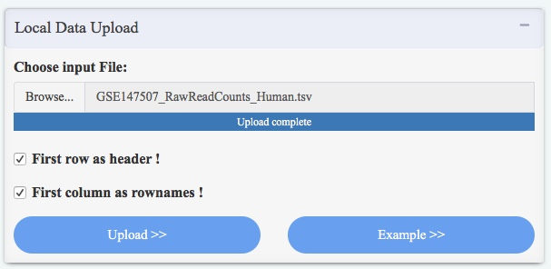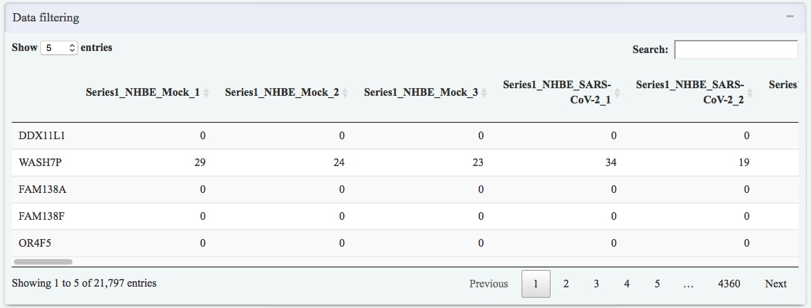

### 4.2 download data from GEO

- Users can search datasets they are interseted in by specific some parameters like  "Search Fields" and "Organism", then active the "Search GEO Data Sets" button to start the searching engine, results will be shown in the right preview panel. 
- Or you can skip this step if you known exactly which datasets you are interested.

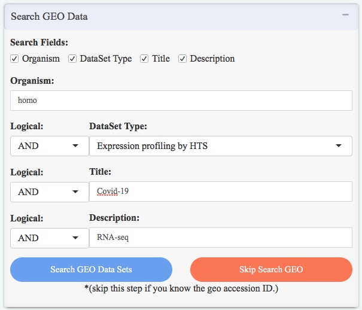


- After detemind which datasets you want to analyze, input this Series_Accession number to the input box below and click the "fetch data" button. Then the datasets will be downloaded to the working directory.
- When the expression matrix was downloaded from GEO website, user can select one or more expresion files (e.g. htseq-count generate one expression file for each sample) and proper parameters the go to "Preview GEO" to preview or generate (if multiple files were selected) expression matrix in the right panel. Click "GO NEXT" button to the next section.

 

### 4.3 pre-filtering data

After clicking the "Upload" button in **Local Module** or the "GO NEXT" button of **GEO Module**, the following analysis steps will be consistent from this section.

- To facilitate subsequent analysis (e.g. GO or KEGG), users need select the proper species and gene types parameters of their datasets.

- <font>Our count matrix contains many rows with only zeros, and additionally many rows with only a few fragments total. In order to reduce the size of the object, and to increase the speed of our functions, we can remove the rows that have no or nearly no information about the amount of gene expression. Here we apply the most minimal filtering rule: removing rows that have no counts, or only a single count across all samples. </font>
- After click the "Filter Data" button, a density plot will be generated in the right panel and some words will be printed in the bottom to tell you how many genes were filtered and how many genes were keeped for downstream analysis.

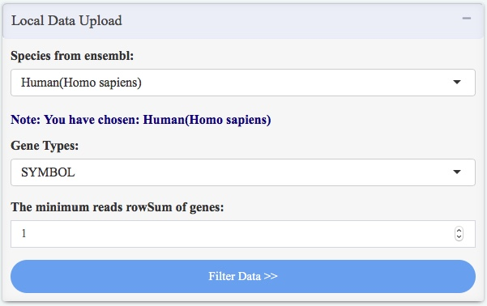 

## 5. Data Normalizing and transforming

<font>*DESeq2* offers two transformations for count data that stabilize the variance across the mean: the *variance stabilizing transformation* (VST) for negative binomial data with a dispersion-mean trend (Anders and Huber 2010), implemented in the *vst* function, and the *regularized-logarithm transformation* or *rlog* (Love, Huber, and Anders 2014).For genes with high counts, both the VST and the rlog will give similar result to the ordinary log2 transformation of normalized counts. For genes with lower counts, however, the values are shrunken towards a middle value. The VST or rlog-transformed data then become approximately homoskedastic (more flat trend in the *meanSdPlot*), and can be used directly for computing distances between samples, making PCA plots, or as input to downstream methods which perform best with homoskedastic data.</font>

<font>**Which transformation to choose?** The VST is much faster to compute and is less sensitive to high count outliers than the rlog. The rlog tends to work well on small datasets (n < 30), potentially outperforming the VST when there is a wide range of sequencing depth across samples (an order of magnitude difference). We therefore recommend the VST for medium-to-large datasets (n > 30). </font>

### 5.1 Design the experiment condition table
- <font>The simplest design formula for differential expression would be `~ condition`, where `condition` is a column that specifies which of two (or more groups) the samples belong to. If the samples were named like **control-1, control-2, sample-1, sample-2...**, the condition column will be extracted as **control, control, sample, sample...** automaticlly. If the condition column can not group the sample properly, user need download the table as csv format and edited it properly and then re-upload this file by active the check box "upload a experiment design tab !" in the right panel.</font>

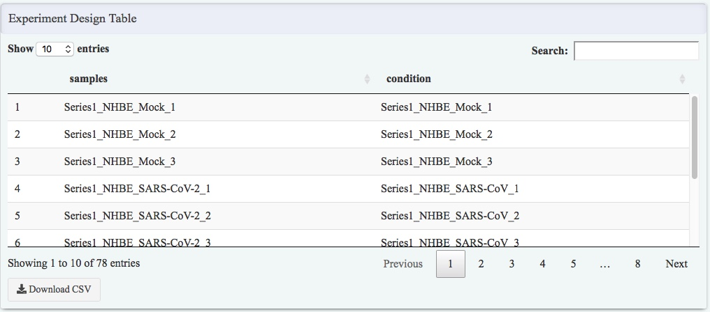 `>>`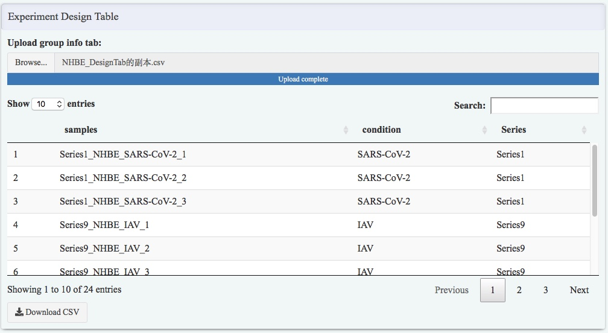

### 5.2 Batch factor correction

- If your data have a batch effector that you already known or that was detected in the data quality assessment section, a column can be added to the design table and this coumn can be treated as batch effector whe we process the data. 
- To approach this function, you need click the "Additional Parameters for Normalization" button and select the method for correcting the batch effects and select the batch factors.

 `>>`    

### 5.3 Normalization and transformation

- After finished the experimental condition table and finished  all the proper parameters, you can start to run DESeq to nomalize and choice one of the methods (rlog or vst) to transform the normalized data.
- <font>Due to this process usually takes some time, repeatedly run this step is not necessary, so we provide a cache button, can let the running results stored in the cache directory of the current working environment, so the next time the user to run the data again, just open the button can be directly to load the last result, this will save a lot of time.</font>


## 6. Data Quality Assessment

<font>Data quality assessment and quality control (i.e. the removal of insufficiently good data) are essential steps of any data analysis. These steps should typically be performed very early in the analysis of a new data set, preceding or in parallel to the differential expression testing.</font>

<font>We define the term *quality* as *fitness for purpose*. Our purpose is the detection of differentially expressed genes, and we are looking in particular for samples whose experimental treatment suffered from an anormality that renders the data points obtained from these particular samples detrimental to our purpose.</font>

### 6.1 Principal Component Analysis (PCA)
- The PCA plot shows the samples in the 2D plane spanned by their first two principal components. This type of plot is useful for visualizing the overall effect of experimental covariates and batch effects.

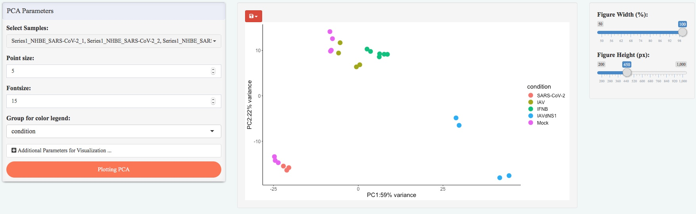

- In the "addtional parameters" dialog window, the user can directly enter the ggplot2 codes to make personalized changes to the graphics. The example below showed that change text family to "Times", text face to "bold" and fontsize to 20 through one line ggplot2 codes.

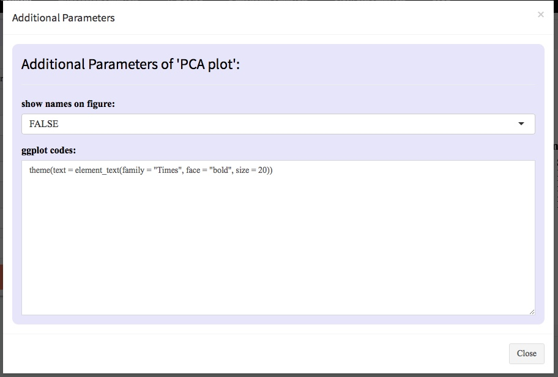 `>>`

### 6.2 Hierarchical Clustering Heatmap

In the hierarchical clustering heatmap the dendrogram at the side shows us a hierarchical clustering of the samples and genes. Since the clustering is only relevant for genes that actually carry a signal, one usually would only cluster a subset of the most highly variable genes. Here, we select the top 500 (default) highest variance genes across samples to generate the hierarchical clustered heatmap.


- By modifying the parameters properly, user can easily change the color and other features of heat map .

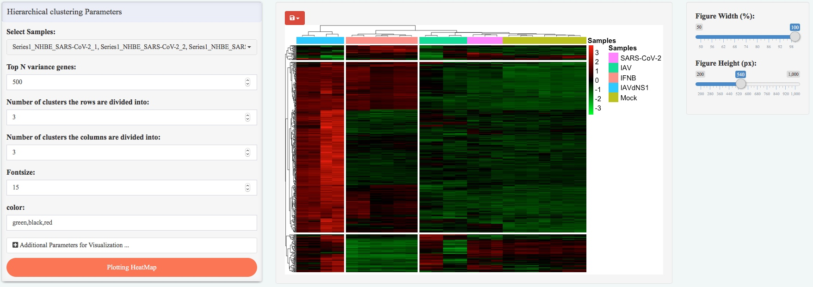

### 6.3 Sample to Sample Distance
<font>A heatmap of this distance matrix gives us an overview over similarities and dissimilarities between samples. We have to provide a hierarchical clustering hc to the heatmap function based on the sample distances, or else the heatmap function would calculate a clustering based on the distances between the rows/columns of the distance matrix.</font>

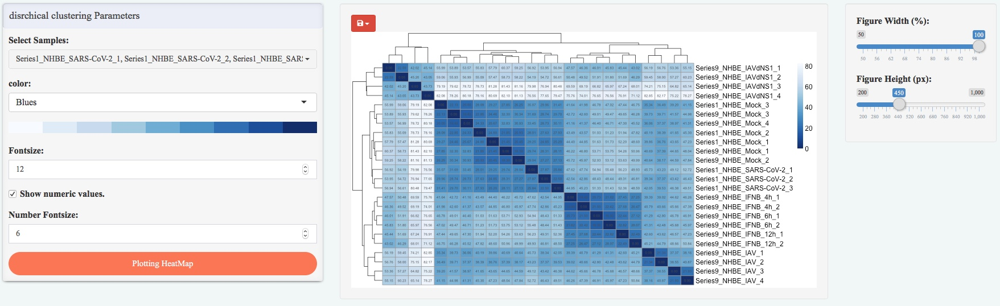

### 6.4 Sample correlation coefficients

<font>The sample correlation coefficient, r, estimates the population correlation coefficient, ρ. It indicates how closely a scattergram of x,y points cluster about a 45° straight line. A tight cluster implies a high degree of association. The coefficient of determination R2 indicates the proportion of ability to predict y that can be attributed to the model using the independent (predictor) variables. In the case of a single predictor x in a straight-line relationship with y, R2 is just the square of r. </font>

#### 6.4.1 pairwise scatter plot

You can generate pairwise scatterplot bettween any two condition groups. Rlog data, VST data or log2(normalized_counts + 1) was supported to perform this analysis. Ggplot2 codes also were supported to modify features of the figure.

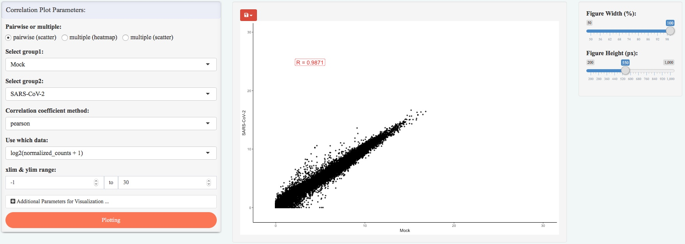

#### 6.4.2 sample correlation heatmap

The sample correlation heatmap provides a more intuitive way of visualizing the correlation between your samples. And you can also adjust multiple aesthetics of the plot.


#### 6.4.3 pairwise scatter panels

<font>Pairs.panels shows a scatter plot of matrices (SPLOM), with bivariate scatter plots below the diagonal, histograms on the diagonal, and the Pearson correlation above the diagonal. Useful for descriptive statistics of small data sets. **DO NOT** run this module if you have too many samples/cells, you should instead use sample correlation heatmap.</font>


## 7. Differential Expression Analysis

<font>The results tables of differentially expressed genes will be generated in this section, which extracts a results table with log2 fold changes, *p* values and adjusted *p* values. To extract the results table of differentially expressed genes, user need to specify the control group, treatment group, *p* value threshold and log2 fold changes threshold. After that, DEG tables will be save to DEG directory in the current working environment. User can perform the analysis on DEG tables by select different group of DEG tables.</font>

### 7.1 Volcano plot
<font>Volcano plots are increasingly popular in ‘omics’ type experiments (e.g., genomics, proteomics, and metabolomics) that typically compare two conditions (e.g., wild-type vs. mutant or healthy vs. disease) and involve many thousands of replicate data points. By separating these data by the magnitude of the difference between the two conditions (on the x-axis) and the statistical significance of that difference (on the y-axis), it’s possible to quickly pick out those data points (e.g., genes or proteins) that display a large magnitude change but are also statistically significant.</font>


### 7.2 DEG heatmap
<font>Heatmaps are a great way of displaying three-dimensional data in only two dimensions. It can help find differences, similarities, variability between groups of genes or conditions in terms of direction of change in gene expression, its magnitude, its statistical significance, and baseline expression level.</font>

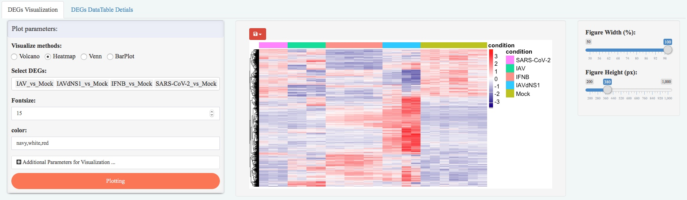
### 7.3 DEG VennDiagram
<font>This function can compute Venn intersects for large numbers of sample sets and plots 2-5 way Venn diagrams. A useful feature is the possiblity to combine the counts from several Venn comparisons with the same number of sample sets in a single Venn diagram.</font>


### 7.4 DEG Number Barplot
<font>Filter and plot DEG results for up and down regulated genes.</font>


### 7.5 DEG Detail Table
Results tables are generated using the function *results*, which extracts a results table with log2 fold changes, p values and adjusted p values. A typical RNA-seq experiment may have many LFCs between -1 and 1, padj < 0.05.

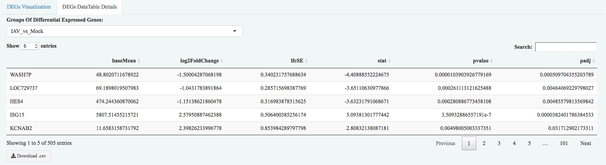

## 8. Differentially Expressed Gene Patterns

<font>Many methods for time-course experiments aim to identify differentially expressed genes between multi-series time-courses (e.g. two treatments monitored over time). Alternatively, single-series time-course experiments, those where a single treatment is monitored over time, are also of biological interest. In these experiments, genes with dynamic expression patterns over time are identified, which can provide insight on regulatory genes and reveal key transitional periods. In this section, we show how to detect expression patterns of differentilly expressed genes across samples. Mainly useful when data is a time course experiment. This part of the function will help users calculate the differentially expressed genes with the same expression trend and display them in the form of line map or heat map.</font>

### 8.1 Run parameters

- Select groups of differentially expressed genes which you are intreseted in.
- ***Note that the number of genes to return should smaller than the number of differentially expressed genes, otherwise analysis will be failed***


### 8.2 Visualize the expression patterns

- After the completion of data calculation, selecting the appropriate visualization method to plot the results.

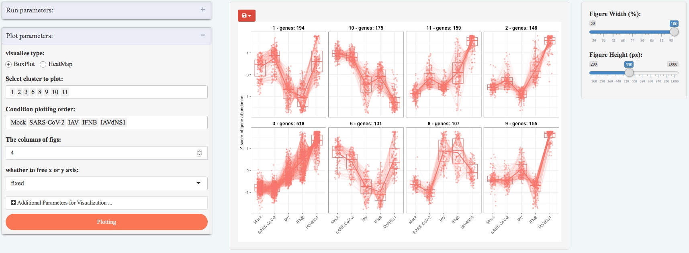

## 9. Gene Expression Visualization
Another basic function of RNA-seq is to visualize the level of gene expression. Here we offer different data sources (transformed data, normalized data, log2foldchange, eg.) and multiple ways to plotting the results. This will give users more options to better present their data.
### 9.1 Expression BarPlot
A barplot or barplots of expression values with confidence intervals for a given gene, set of genes. 

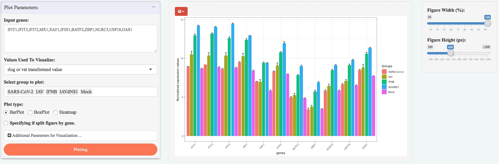

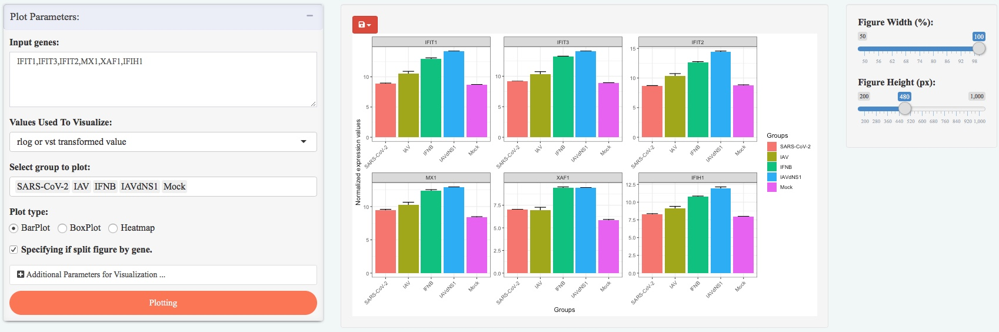

### 9.2 Expression BoxPlot
A boxplot or boxplots of expression values with confidence intervals for a given gene, set of genes. 

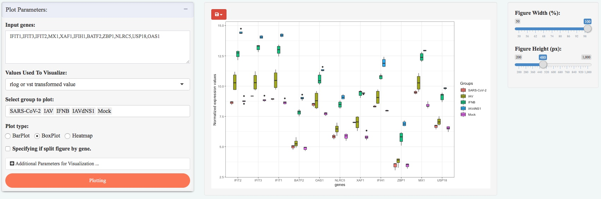

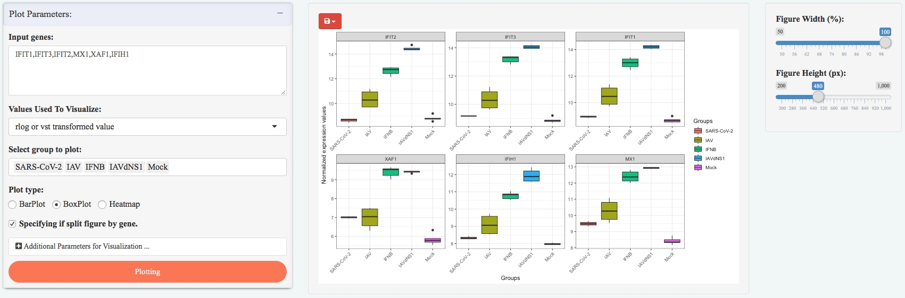

### 9.3 Expression HeatMap
Heat map is a well-received approach to illustrate gene expression data.  It is an impressive visual exhibit that addresses explosive amounts of NGS data. It’s packed with closely set patches in shades of colors, pomping the gene expression data of multifarious high-throughput tryouts.


### 9.4 Log2FoldChage BarPlot
The Log2 fold-change (L2FC) is an estimate of the log2 ratio of expression in a cluster to that in all other cells. A value of 1.0 indicates 2-fold greater expression in the cluster of interest.

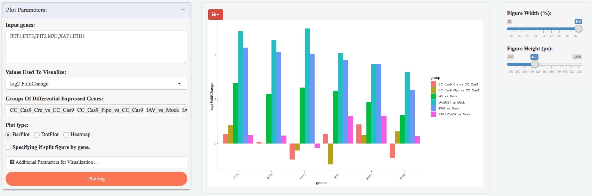

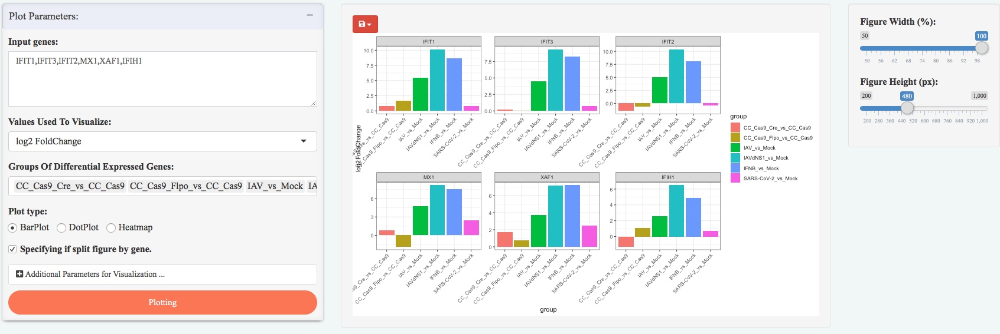

### 9.5 Log2FoldChage HeatMap
Heat map of gene expression log2foldchanges across different groups.

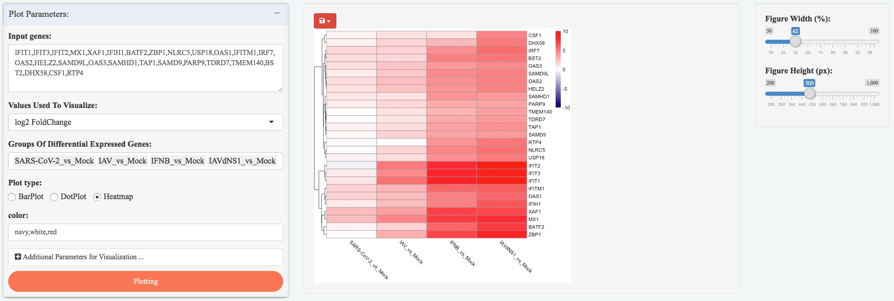
### 9.6 Log2FoldChage DotPlot
Dot plot of gene expression log2foldchanges across different groups.


## 10. WGCNA analysis
<font>Correlation networks are increasingly being used in bioinformatics applications. For example, weighted gene co-expression network analysis is a systems biology method for describing the correlation patterns among genes across microarray samples. Weighted correlation network analysis (WGCNA) can be used for finding clusters (modules) of highly correlated genes, for summarizing such clusters using the module eigengene or an intramodular hub gene, for relating modules to one another and to external sample traits (using eigengene network methodology), and for calculating module membership measures. Correlation networks facilitate network based gene screening methods that can be used to identify candidate biomarkers or therapeutic targets.</font>

### 10.1 Data Preparation
<font>This is the first step of any network analysis. We show here how to load typical expression data, pre-process them into a format suitable for network analysis, and clean the data by removing obvious outlier samples as well as genes and samples with excessive numbers of missing entries.
And then load in the trait data and match the samples for which they were measured to the expression samples.</font>

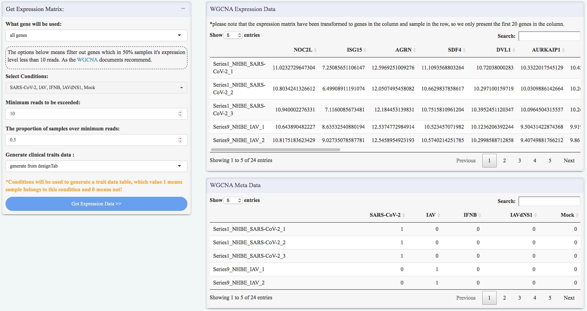

### 10.2 Modules Detection
<font>This step is the bedrock of all network analyses using the WGCNA methodology.We using a convenient 1-step network construction and module detection function. Automatically choose soft-thresholding power for network construction and module detection.</font>

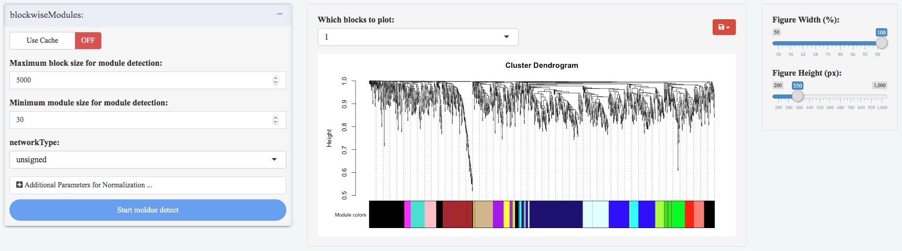
### 10.3 Gene Significance and Module Membership
<font>We quantify associations of individual genes with our trait of interest by defining Gene Significance GS as (the absolute value of) the correlation between the gene and the trait. For each module, we also define a quantitative measure of module membership MM as the correlation of the module eigengene and the gene expression profile. This allows us to quantify the similarity of all genes on the array to every module.</font>

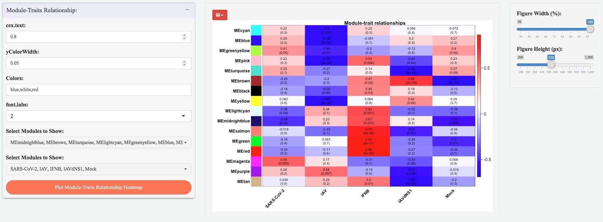

## 11. Functional Enrichment Analysis

<font>Enrichment analysis is a means to characterize biological attributes in a given gene set. Over Representation Analysis (ORA) is a widely used approach to determine whether known biological functions or processes are over-represented (= enriched) in an experimentally-derived gene list, e.g. a list of differentially expressed genes (DEGs). While all genes can be used in Gene Set Enrichment Analysis (GSEA); GSEA aggregates the per gene statistics across genes within a gene set, therefore making it possible to detect situations where all genes in a predefined set change in a small but coordinated way. Since it is likely that many relevant phenotypic differences are manifested by small but consistent changes in a set of genes.</font>

### 11.1 ORA by gprofiler2

<font>[gprofiler2](https://cran.r-project.org/package=gprofiler2) provides an R interface to the widely used web toolset g:Profiler (https://biit.cs.ut.ee/gprofiler). The toolset performs functional enrichment analysis and visualization of gene lists, converts gene/protein/SNP identifiers to numerous namespaces, and maps orthologous genes across species. [g:Profiler](https://biit.cs.ut.ee/gprofiler) relies on [Ensembl databases](https://www.ensembl.org/index.html) as the primary data source and follows their release cycle for updates.</font>

#### 11.1.1 Running Parameters

<font>gprofiler2 enables to perform functional profiling of gene lists. The function performs statistical enrichment analysis to find over-representation of functions from Gene Ontology, biological pathways like KEGG and Reactome, human disease annotations, etc. This is done with the hypergeometric test followed by correction for multiple testing.</font>

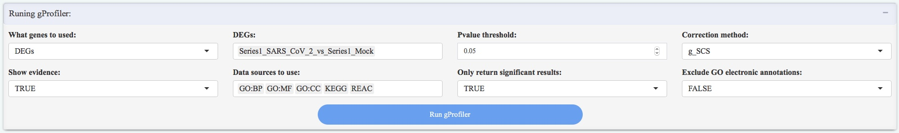

#### 11.1.2 Visualization by gostplot

<font>The enrichment results are visualized with a [Manhattan-like-plot](https://biit.cs.ut.ee/gprofiler/page/docs#gost) using the function `gostplot` and the previously found enrichment results.The x-axis represents the functional terms that are grouped and color-coded according to data sources and positioned according to the fixed **"source_order"**. This section enables to highlight a selection of interesting terms from the results with numbers and table of results. These can be set with parameter `highlight_terms` listing the term IDs in a `vector` or as a `data.frame` with column **"term_id"** such as a subset of the result `data.frame`. </font>


#### 11.1.3 Visualization by gosttable

<font>The enrichment results can also be visualized with a table. The `gosttable` will create a nice-looking table with the result statistics for the `highlight_terms` from the result `data.frame`. The `Columns will be showed` parameter is used to list the names of additional columns to show in the table in addition to the **"term_id"** and **"p_value"**.</font>

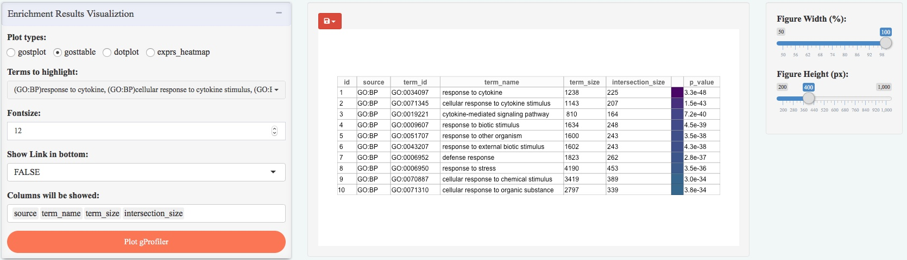

#### 11.1.4 Visualization by dotplot

<font>For comparing different enrichment results, the x-axis represent different gene clusters while for a single enrichment result, the x-axis can be gene count or gene ratio. This is actually similar to traditional barplot, with dot position as bar height and dot color as bar color. But dotplot can represent one more feature nicely by dot size and it can be a good alternative to barplot.</font>


#### 11.1.5 Visualization by heatmap

To facilitate the exploration of gene expression in the specific enrichment term, we support users to use heat maps to visualize the expression of genes in any term they are interested in. 

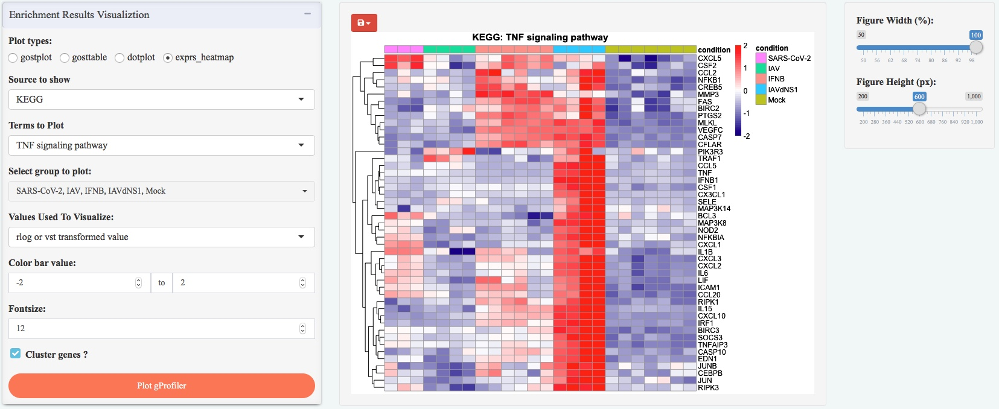


### 11.2 ORA By clusterProfiler

Over Representation Analysis (ORA) is a widely used approach to determine whether known biological functions or processes are over-represented (= enriched) in an experimentally-derived gene list, e.g. a list of differentially expressed genes (DEGs). 
#### 11.2.1 Running Parameters 
- GO analyses support organisms that have an `OrgDb`object available. Bioconductor have already provide `OrgDb` for about [20 species](http://bioconductor.org/packages/release/BiocViews.html#___OrgDb).
- KEGG pathway analysis support about 500 organisms, user can select proper organisms in the beginning.
- Ractome pathway analysis only support seven organisms, that are "human", "rat", "mouse", "celegans", "yeast", "zebrafish" and "fly".

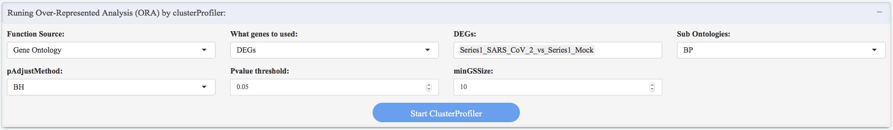

#### 11.2.2 Visualization by barplot
Bar plot is the most widely used method to visualize enriched terms. It depicts the enrichment scores (e.g. p values) and gene count or ratio as bar height and color.

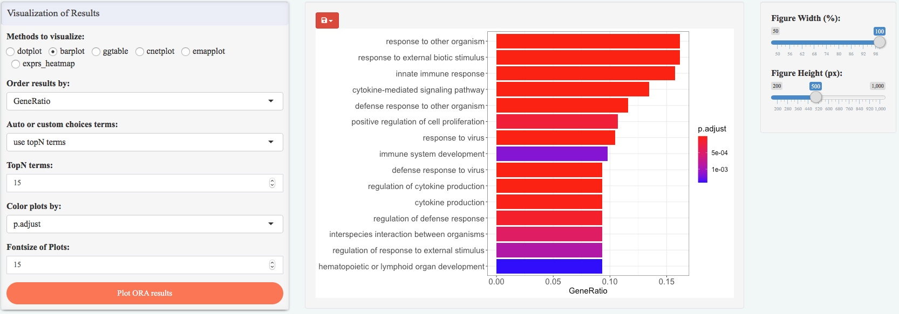
#### 11.2.3 Visualization by dotplot
Dot plot is similar to bar plot with the capability to encode another score as dot size.

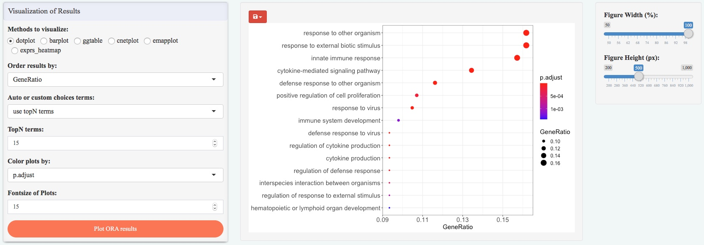
#### 11.2.4 Visualization by ggtable
The enrichment results can also be visualized with a table. This function will create a nice-looking table with the result statistics for the interested terms from the result data frame. 


#### 11.2.5 Visualization by cnetplot
Both the barplot and dotplot only displayed most significant enriched terms, while users may want to know which genes are involved in these significant terms. The cnetplot depicts the linkages of genes and biological concepts (e.g. GO terms or KEGG pathways) as a network to extract the complex association. 

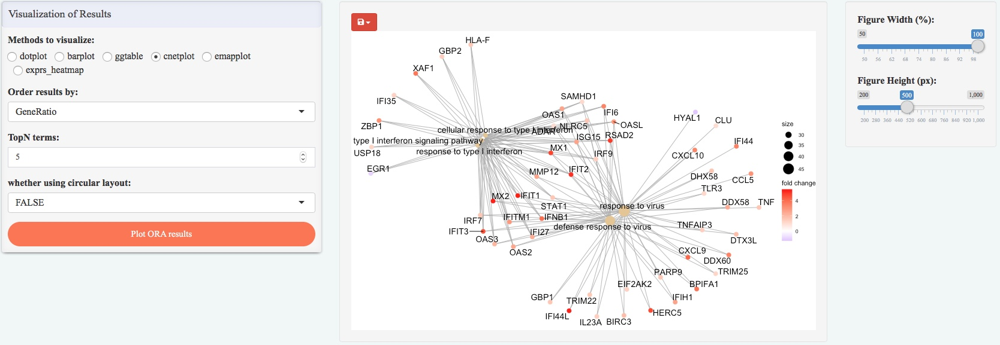
#### 11.2.6 Visualization by emapplot
Enrichment map organizes enriched terms into a network with edges connecting overlapping gene sets. In this way, mutually overlapping gene sets are tend to cluster together, making it easy to identify functional module.

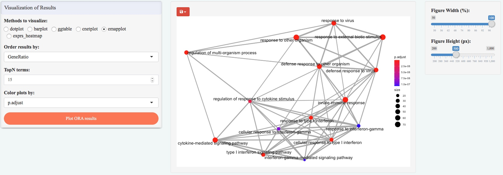
#### 11.2.7 Visualization by heatmap
In addition to knowing which biological functions (e.g. GO terms or KEGG pathways) the gene set is enriched in, users may also want to know the gene expression in a particular enriched biological functions. Therefore, we support drawing gene expression heat maps of specific biological functions directly from the enrichment results, so as to facilitate users to explore the target genes they are interested in.


### 11.3 GSEA by clusterProfiler
A common approach in analyzing gene expression profiles was identifying differential expressed genes that are deemed interesting. This approach will find genes where the difference is large, but it will not detect a situation where the difference is small, but evidenced in coordinated way in a set of related genes. Gene Set Enrichment Analysis (GSEA) directly addresses this limitation. All genes can be used in GSEA; GSEA aggregates the per gene statistics across genes within a gene set, therefore making it possible to detect situations where all genes in a predefined set change in a small but coordinated way. Since it is likely that many relevant phenotypic differences are manifested by small but consistent changes in a set of genes.
#### 11.3.1 Running Parameters
- GO analyses support organisms that have an `OrgDb`object available. Bioconductor have already provide `OrgDb` for about [20 species](http://bioconductor.org/packages/release/BiocViews.html#___OrgDb).
- KEGG pathway analysis support about 500 organisms, user can select proper organisms in the beginning.
- Ractome pathway analysis only support seven organisms, that are "human", "rat", "mouse", "celegans", "yeast", "zebrafish" and "fly".

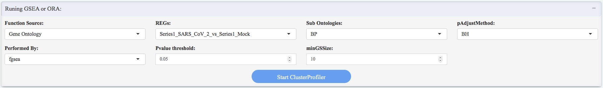

#### 11.3.2 Visualization by gseaplot2
Running score and preranked list are traditional methods for visualizing GSEA result. Both of them were supported to visualize the distribution of the gene set and the enrichment score. We also support multile gene sets to be displayed on the same figure and display the pvalue table on the plot.


#### 11.3.3 Visualization by ridgeplot
The ridgeplot will visualize expression distributions of core enriched genes for GSEA enriched categories. It helps users to interpret up/down-regulated pathways.


#### 11.3.4 Visualization by heatmap
Similarly, heat maps of gene expression in specific biological functions allow users to explore target genes of interest.

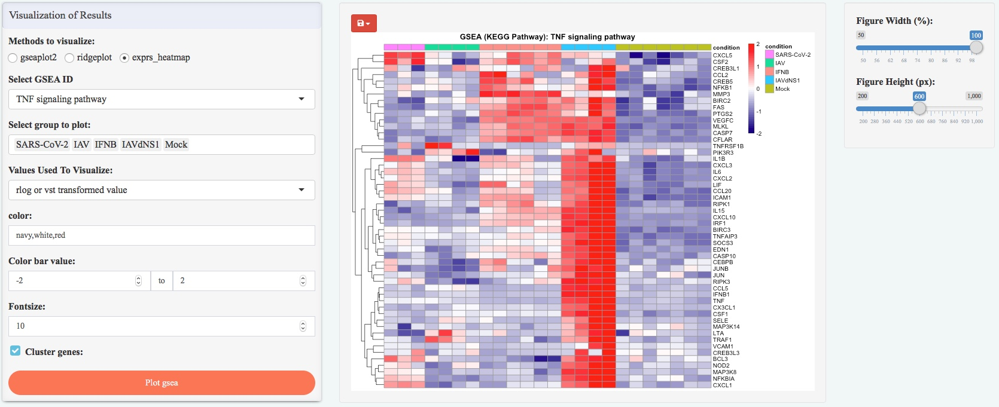

## 12. Network Analysis

<font>Studies have pointed out that the expression of genes are highly regulated, which result in a cascade of distinct patterns of coexpression forming a network. Identifying and understanding such patterns is crucial in deciphering the mechanism of gene expression regulation and expression heterogeneity. We provide three methods to perform the network analysis: ***KEGG pathview***, ***Protein-to-protein network*** and ***Gene regulatory networks***.</font>

### 12.1 KEGG pathview

<font>Pathview is a tool set for pathway based data integration and visualization. It maps and renders a wide variety of biological data on relevant pathway graphs. All users need is to supply their data and specify the target pathway. Pathview automatically downloads the pathway graph data, parses the data file, maps user data to the pathway, and render pathway graph with the mapped data. In addition, Pathview also seamlessly integrates with pathway and gene set (enrichment) analysis tools for large-scale and fully automated analysis.</font>

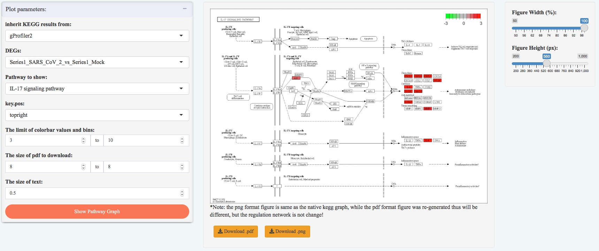

### 12.2 Protein-to-protein network

<font>STRING (https://www.string-db.org) is a database of known and predicted protein-protein interac- tions. The interactions include direct (physical) and indirect (functional) associations. The database contains information from numerous sources, including experimental repositories, computational pre- diction methods and public text collections. Each interaction is associated with a combined confidence score that integrates the various evidences.</font>

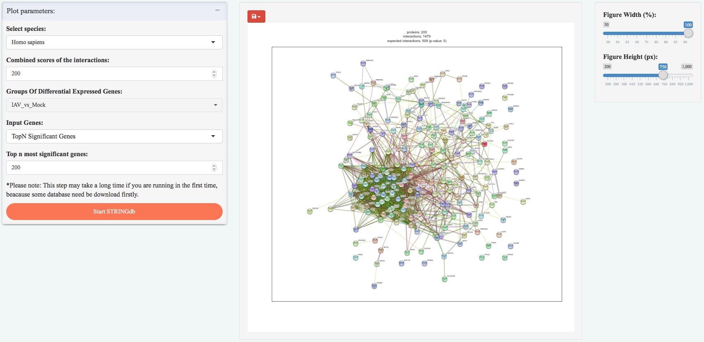

### 12.3 Gene regulatory networks

<font>One of the urgent problems in computational systems biology is to clarify the genetic regulatory networks (GRN) using high-throughput genomic data. GENIE3 is a machine learning-based algorithm based on regression trees for inferring gene regulatory networks from expression data [28]. Finally, a matrix containing the putative regulatory links will be generated. R packages edgebundleR and visNetwork were used in this section to visualize the regulatory networks.</font>

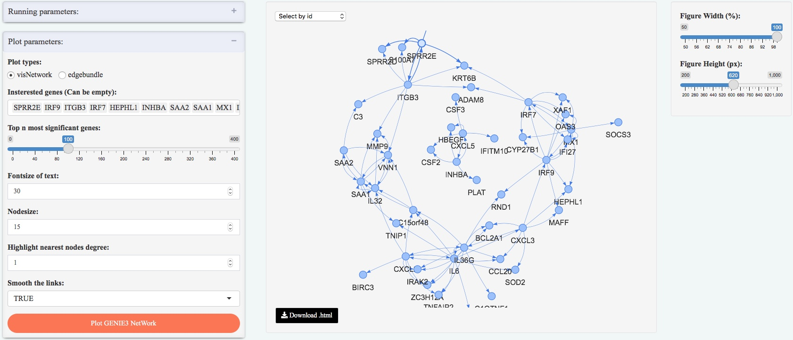

## 13. Summarize genes and functions

<font>Because we provide three methods to detect genes: ___DEGs___, ___WGCNA___ and ___DEG Patterns___, And three functional enrichment analysis methods are also provided: ___clusterprofiler ORA___, ___clusterprofiler GSEA___ and ___gprofiler2 ORA___. This may leave users unsure how to choose a appropriate result. Therefore, we provide a summary module that uses a Venn diagram to visualize the intersection between the three methods, as well as print out tabular details of the results detected simultaneously in the three methods.</font>

### 13.1 Summarize genes

Before this part, the analysis of ___DEGs___, ___WGCNA___ and ___DEG Patterns___ should be completed. Then select ___DEGs grouping___, ___Pattern Gene module___ and ___WGCNA module___ to complete the analysis process.

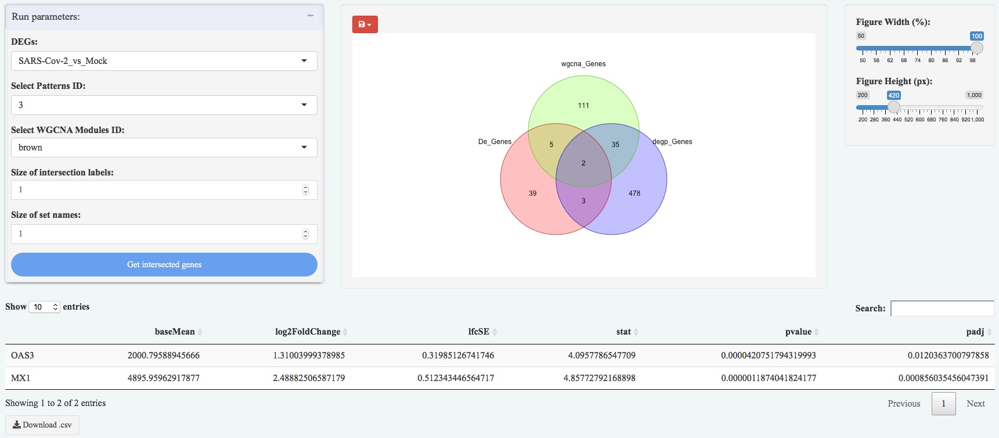

### 13.2 Summarize functions

Before this part, the analysis of ___clusterprofiler ORA___, ___clusterprofiler GSEA___ and ___gprofiler2 ORA___ should be completed. Then select proper data sources (e.g. GO:BP or KEGG) to complete the analysis process.

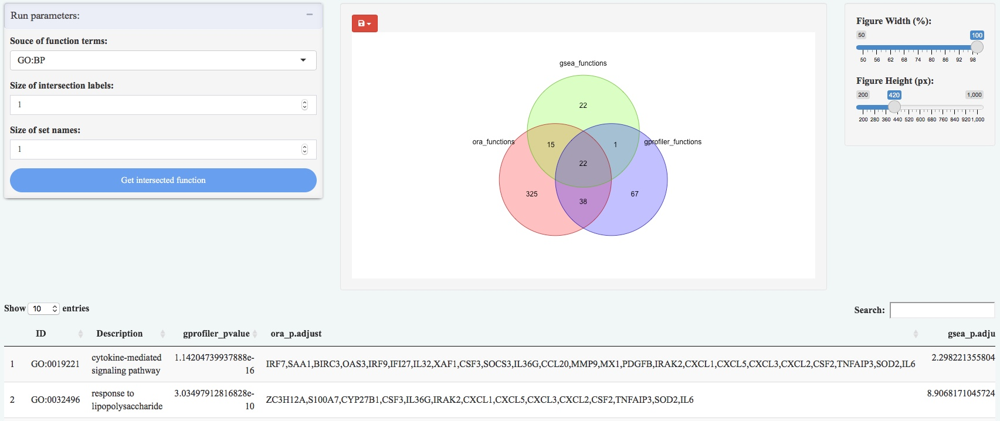

